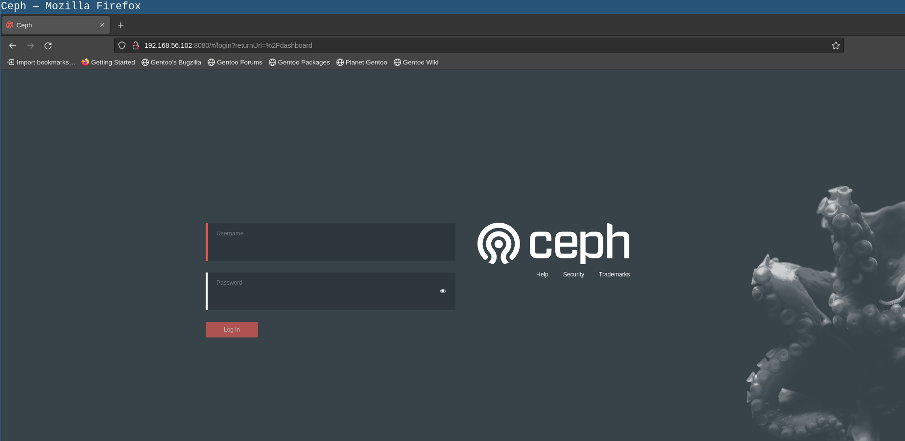

# Gentoo RISC-V  Ceph 安装测试记录


[TOC]


## 环境


unmatch board * 1 （这里只是做一些简单的功能性测试，后续会做集群测试 集群配置和单点配置有所不同使用时请注意）

Gentoo Linux with system init (暂未在openrc的init系统上测试)

ceph version 17.2.5 quincy (stable) 98318ae89f1a893a6ded3a640405cdbb33e08757


这篇文章着重于部署和测试，不会展开讲概念之类的；如果你想要了解ceph的具体信息可以参考官网：https://docs.ceph.com/

这篇文章参考了：https://docs.ceph.com/en/latest/install/manual-deployment/ 进行安装和部署

systemd service文件的修改参考了：https://bugs.launchpad.net/ubuntu/+source/ceph/+bug/1917414


## 安装ceph


安装之前需要借助portage的能力给ceph打patch才能够正常安装（感谢peeweep的工作）

确保`/etc/portage/patches/sys-cluster/ceph/`目录已经创建

```shell
mkdir -pv /etc/portage/patches/sys-cluster/ceph/
```

在这个目录下下载以下patchs：

```shell
cd /etc/portage/patches/sys-cluster/ceph/
wget -c https://whale.plctlab.org/~peeweep/patches/ceph/01-ceph-arrow.patch
wget -c https://whale.plctlab.org/~peeweep/patches/ceph/47883.patch
wget -c https://whale.plctlab.org/~peeweep/patches/ceph/49517.patch
```

安装ceph：

```shell
emerge -v sys-cluster/ceph
```


## 配置ceph


### 配置mon


在gentoo里面`/etc/ceph`文件夹没有被默认创建（可以考虑后续优化一下ebuild），需要手动创建一下：

```shell
mkdir -pv /etc/ceph
```

生成一个uuid作为此次集群使用：

```shell
uuidgen
```

创建并编辑`/etc/ceph/ceph.conf` 文件内容如下：

```shell
[global]
fsid = a7f64266-0894-4f1e-a635-d0aeaca0e993 # 使用uuidgen的
mon initial members = gentoo # 初始化mon的节点名称
mon host = 192.168.56.102 # mon节点的ip
public network = 192.168.56.0/24 # 公开的网络
auth cluster required = cephx
auth service required = cephx
auth client required = cephx
osd journal size = 1024
osd pool default size = 3
osd pool default min size = 2
osd pool default pg num = 333
osd pool default pgp num = 333
osd crush chooseleaf type = 1
```

创建客户端的admin keyring：

```shell
ceph-authtool --create-keyring /etc/ceph/ceph.client.admin.keyring --gen-key -n client.admin --cap mon 'allow *' --cap osd 'allow *' --cap mds 'allow *' --cap mgr 'allow *'
```

导入客户端admin的keyring：

```shell
ceph-authtool /tmp/ceph.mon.keyring --import-keyring /etc/ceph/ceph.client.admin.keyring
```

创建mon的keyring：

```shell
ceph-authtool --create-keyring /tmp/ceph.mon.keyring --gen-key -n mon. --cap mon 'allow *'
```

修改mon keyring的权限：

```shell
chown ceph:ceph /tmp/ceph.mon.keyring
```

使用主机名，ip地址和集群uuid去生成mon map

```shell
monmaptool --create --add gentoo  192.168.56.102 --fsid a7f64266-0894-4f1e-a635-d0aeaca0e993 /tmp/monmap
```

创建mon文件夹：

```shell
sudo -u ceph mkdir -p /var/lib/ceph/mon/ceph-gentoo # clustername-nodename 的这种格式
```

使用mon map和keyring 填充mon的daemon

```shell
sudo -u ceph ceph-mon --mkfs -i gentoo --monmap /tmp/monmap --keyring /tmp/ceph.mon.keyring
```

这里的gentoo 要替换成在`/etc/ceph/ceph.conf` 里面配置的`mon initial members` 名称

在启动mon之前需要对默认的systemd service文件进行修改

```shell
vi /lib/systemd/system/ceph-mon@.service
```

修改`MemoryDenyWriteExecute`的值为`false` 这个具体原因可以看 https://bugs.launchpad.net/ubuntu/+source/ceph/+bug/1917414


修改完成之后:

```shell
systemctl daemon-reload
```

启动mon:

```shell
systemctl start ceph-osd@gentoo 
```

加入开机启动（可选）：

```shell
systemctl enable ceph-osd@gentoo 
```

查看运行状态：
```shell
systemctl status ceph-osd@gentoo 
```


验证：

```shell
ceph -s 
```

在services的部分如果可以看到

```
  services:
    mon: 1 daemons, quorum gentoo (age 15h)
```

就说明mon已经启动成功了。


### 配置mgr


创建mgr对应的目录：

```shell
name=gentoo # gentoo 是这个节点的名称
mkdir -pv /var/lib/ceph/mgr/ceph-$name # 这里的ceph是集群的名称
```

生成mgr的keyring：

```shell
ceph auth get-or-create mgr.$name mon 'allow profile mgr' osd 'allow *' mds 'allow *' >>  /var/lib/ceph/mgr/ceph-$name/keyring 
```

启动对应的mgr（这里好像是没有直接启动，还是要systemd来启动）：
```shell
ceph-mgr -i $name
```


使用systemd启动之前需要先将`/lib/systemd/system/ceph-mgr@.service` 配置文件中的`MemoryDenyWriteExecute` 设置为`false`


```shell
vi /lib/systemd/system/ceph-mgr@.service
```

修改完成之后运行：

```shell
systemctl daemon-reload
```

启动服务：

```shell
systemctl start ceph-mgr@gentoo.service
```


验证：

```shell
ceph -s
```


在services的部分可以看到mgr已经启动了：
```shell
  services:
    mon: 1 daemons, quorum gentoo (age 15h)
    mgr: gentoo(active, since 76m)
```


### 配置osd


这里使用的是手动添加osd的方式进行配置和使用，也可以用ceph-volume的方式去配置。

使用dd创建一个镜像文件：

```shell
dd if=/dev/zero of=/ceph-osd.img bs=1G count=4 
```

使用losetup将这个文件虚拟成块设备

```shell
losetup /dev/loop0 /ceph-osd.img
```


为OSD生成一个uuid ：

```shell
osd_uuid=$(uuidgen)
echo $osd_uuid
```

在集群中创建一个新的OSD：

```shell
id=$(ceph osd create $osd_uuid)
echo $id
```

创建对应的挂载点：

```shell
mkdir -p /var/lib/ceph/osd/ceph-$id
```

格式化虚拟块设备(这里使用的是xfs）：
```shell
mkfs.xfs /dev/loop0
```

挂载设备：

 ```shell
 mount -o rw,inode64 /dev/loop0 /var/lib/ceph/osd/ceph-$id
 ```

修改权限：

```shell
chown ceph: /var/lib/ceph/osd/ceph-$id -R
```


创建osd的keyring：

```shell
ceph auth add osd.$id osd 'allow *' mon 'allow profile osd' -i /var/lib/ceph/osd/ceph-$id/keyring
```


开机挂载（可选）：


```shell
fs_uuid=$(blkid -o value /dev/loop0 | cut -f1 -d$'\n')
echo "UUID=$fs_uuid /var/lib/ceph/osd/ceph-$id xfs rw,inode64 0 0" >> /etc/fstab
```

创建osd文件：

```shell
ceph-osd -i $id --mkfs --mkkey --no-mon-config --osd-uuid $osd_uuid
```

在启动osd之前需要先修改一下`/lib/systemd/system/ceph-osd@.service` 文件：

```shell
vi /lib/systemd/system/ceph-osd@.service
```

将`MemoryDenyWriteExecute`的值修改为`false`


然后运行：

```shell
systemctl daemon-reload
```


启动osd服务：
```shell
systemctl start ceph-osd@gentoo.service
```


验证：
```shell
ceph -s
```


看到service 的部分有osd启动即可：
```shell
  cluster:
    id:     a7f64266-0894-4f1e-a635-d0aeaca0e993
    health: HEALTH_WARN
            mon is allowing insecure global_id reclaim
            1 monitors have not enabled msgr2
            OSD count 1 < osd_pool_default_size 3

  services:
    mon: 1 daemons, quorum gentoo (age 16h)
    mgr: gentoo(active, since 110m)
    osd: 1 osds: 1 up (since 2h), 1 in (since 2h)

  data:
    pools:   0 pools, 0 pgs
    objects: 0 objects, 0 B
    usage:   4.8 MiB used, 100 GiB / 100 GiB avail
    pgs:
```

查看osd tree:

```shell
ceph osd tree
ID  CLASS  WEIGHT   TYPE NAME        STATUS  REWEIGHT  PRI-AFF
-1         0.09769  root default
-3         0.09769      host gentoo
 0    hdd  0.09769          osd.0        up   1.00000  1.00000
```


## 测试功能


### dashboard


开启dashboard：

```shell
ceph mgr module enable dashboard
```

关闭ssl：

```shell
ceph config set mgr mgr/dashboard/ssl false
```

设置服务器ip地址：
```shell
ceph config set mgr mgr/dashboard/server_addr 192.168.56.102 # 这里替换成你的ip
```


生成密码文件:

```shell
uuidgen > ceph-admin-password.txt
```


创建管理员用户：

```shell
ceph dashboard ac-user-create admin -i  ceph-admin-password.txt administrator
```


验证：

打开浏览器输入：http://ip:8080  ip替换成你的ip，如果一切正常就可以看到ceph的dashboard登陆页面：





输入设置好的账号密码就可以看到ceph的dashboard了：


### 对象存储


### NFS


### 块存储


### iSCSI


### 监控


## TODO List


- 整理patch 
- openrc还需要测试
- systemd 需要修改`MemoryDenyWriteExecute`的值这部分需要单独的patch 

