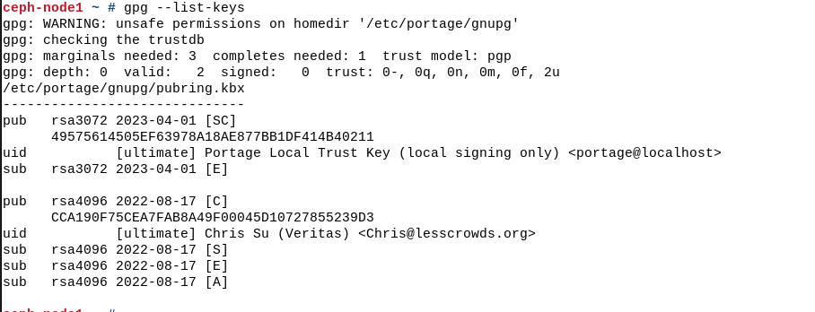
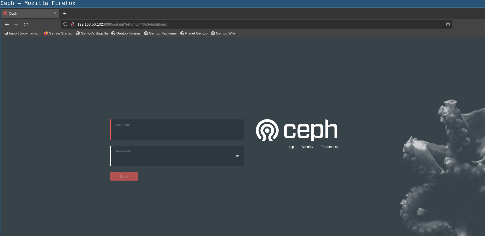
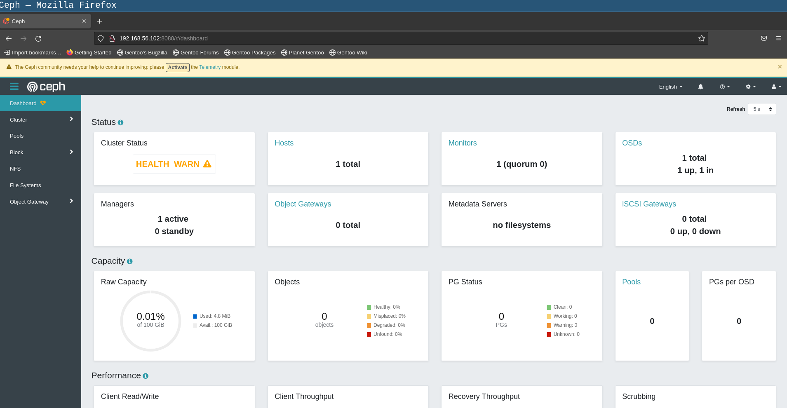

# Gentoo Ceph Cluster


## 环境


這裏使用virtualbox作爲此次的虛擬化軟件

有兩個網卡，一個網卡爲hostonly模式用於客戶端鏈接到節點，另外一個是NAT network 用於虛擬機上網。

- hostonly網絡需要設置爲靜態ip
- NAT network 可以設置靜態 也可以選擇dhcp

Gentoo Linux openrc

| hostname | ip (hostonly) | role |
| ------ | ---- | ---- | 
| ceph-node1 | 192.168.56.10 | mon，mgr, osd | 
| ceph-node2 | 192.168.56.11 | mon，mgr, osd | 
| ceph-node2 | 192.168.56.11 | mon，mgr, osd | 
| gentoo-client | 192.168.56.20 | client | 

192.168.56.1 這個是網關 同時也是資源發佈的服務器


配置靜態ip地址，配置參考 https://wiki.gentoo.org/wiki/Netifrc

> ceph-node1

創建並編輯 `/etc/conf.d/net` 文件，內容如下：


```
cat << EOF > /etc/conf.d/net
# For a static IP using CIDR notation
config_enp0s3="192.168.56.10/24"
config_enp0s8="dhcp"
dns_servers_enp0s8="114.114.114.114"
EOF
```

創建服務的軟鏈接：


```shell
ln -svf /etc/init.d/net.lo /etc/init.d/net.enp0s3
ln -svf /etc/init.d/net.lo /etc/init.d/net.enp0s8
```

開機啓動服務：

```
rc-update add net.enp0s3 default
rc-update add net.enp0s8 default
```

確保關閉dhcpcd或者是networkmanager之類的服務。

```shell
rc-update delete dhcpcd default
```

設置主機名：


```
vi /etc/conf.d/hostname
```

配置`/etc/hosts` 添加内容如下：


```shell
192.168.56.10 ceph-node1
192.168.56.11 ceph-node2
192.168.56.12 ceph-node3
```

重啓機器：

```shell
reboot
```

其他的節點也是類似的操作。

### 时间同步服务器

在集群中时间同步是非常重要的一部分 这里我们需要安装和配置一下NTP

```shell
emerge --ask net-misc/ntp
```

配置ntp
编辑`/etc/conf.d/ntp-client`文件，修改内容如下：

```
NTPCLIENT_CMD="ntpdate"
NTPCLIENT_OPTS="-s -b -u \
	ntp.aliyun.com"
```

启动ntp服务：

```shell
rc-service ntp-client start
```
加入开机启动

```shell
rc-update add ntp-client default
```

查看4个节点的ip是否一样：

```shell
date
```


## binpkg server


### 設置服務端

這裏使用的是gpkg格式的binpkg server，需要一個gpg key 同時還需要一個http來去發佈編譯好的包。

`make.conf`的內容如下：

```
FEATURES="buildpkg binpkg-signing gpg-keepalive"

BINPKG_GPG_SIGNING_GPG_HOME="/etc/portage/gnupg"
BINPKG_GPG_SIGNING_KEY="0x45D10727855239D3"
BINPKG_GPG_VERIFY_GPG_HOME="/etc/portage/gnupg"
BINPKG_FORMAT="gpkg"
GPG_VERIFY_USER_DROP="portage"
GPG_VERIFY_GROUP_DROP="portage"
```

構建整個系統
```shell
emerge -ueDN @world
```

构建ceph:

```shell
emerge -av ceph
```


制作二进制包：

```shell
quickpkg --include-config=y sys-cluster/ceph
```

`--include-config` 这个选项需要是y 不然openrc下面会缺少配置


> 注意這一步需要使用root用戶


發佈內容：

```shell
cd /var/cache/binpkgs
python -m http.server 9000
```

### 客戶端使用

創建一個生成和導入key的腳本`create-portage-local-gpg`，內容如下：

```shell
#!/bin/bash
 
KEY_NAME="sa-slchris.asc"
LOCAL_KEYSERVER="http://192.168.56.109:9001"
KEY="5BB4DC20DCA50A499219935036F2D646E2E89820" # Key fingerprint
 
GPG_DIR="/etc/portage/gnupg"
 
PASS="$(openssl rand -base64 32)"
 
KEY_CONFIG_FILE="$(mktemp)"
chmod 600 "${KEY_CONFIG_FILE}"
 
export GNUPGHOME="${GPG_DIR}"
cat > "${KEY_CONFIG_FILE}" <<EOF
     %echo Generating Portage local OpenPGP trust key
     Key-Type: default
     Subkey-Type: default
     Name-Real: Portage Local Trust Key
     Name-Comment: local signing only
     Name-Email: portage@localhost
     Expire-Date: 0
     Passphrase: ${PASS}
     %commit
     %echo done
EOF
 
mkdir -p "${GNUPGHOME}"
gpg --batch --generate-key "${KEY_CONFIG_FILE}"
rm -f "${KEY_CONFIG_FILE}"
 
touch "${GNUPGHOME}/pass"
chmod 600 "${GNUPGHOME}/pass"
echo "${PASS}" > "${GNUPGHOME}/pass"

curl  $LOCAL_KEYSERVER/$KEY_NAME | gpg --import - 
gpg --batch --yes --pinentry-mode loopback --passphrase "${PASS}" --sign-key "${KEY}" 
echo -e "5\ny\n" | gpg --command-fd 0 --edit-key "${KEY}" trust
 
chmod ugo+r "${GNUPGHOME}/trustdb.gpg"
```

執行：

```shell
bash create-portage-local-gpg
```

執行完成之後可以看到對應的key：



編輯`make.conf`文件添加內容如下：

```shell
EMERGE_DEFAULT_OPTS="${EMERGE_DEFAULT_OPTS} --getbinpkgonly"
FEATURES="getbinpkg binpkg-request-signature"
PORTAGE_BINHOST="http://192.168.56.109:9000"
```


安裝ceph:
```shell
emerge -av ceph
```

## 配置CEPH集群


### MON 配置


在gentoo里面`/etc/ceph`文件夹没有被默认创建（可以考虑后续优化一下ebuild），需要手动创建一下：

```shell
mkdir -pv /etc/ceph
```
生成一个uuid作为此次集群使用：

```shell
uuidgen
```

修改`/etc/conf.d/ceph`文件 取消读取配置文件的注释：

```shell
ceph_conf="/etc/ceph/ceph.conf"
```

> ceph-node1 上操作


创建并编辑`/etc/ceph/ceph.conf` 文件内容如下：

```shell
[global]
fsid = 333c6f6c-124d-4410-bde3-fb6da688dea9 # 使用uuidgen的
mon initial members = mon.a, mon.b, mon.c
mon host = 192.168.56.10:6789, 192.168.56.11:6789, 192.168.56.12:6789
public network = 192.168.56.0/24 # 公开的网络
auth cluster required = cephx
auth service required = cephx
auth client required = cephx
osd journal size = 1024
osd pool default size = 3
osd pool default min size = 2
osd pool default pg num = 333
osd pool default pgp num = 333
osd crush chooseleaf type = 1
```
创建客户端的admin keyring：

```shell
ceph-authtool --create-keyring /etc/ceph/ceph.client.admin.keyring --gen-key -n client.admin --cap mon 'allow *' --cap osd 'allow *' --cap mds 'allow *' --cap mgr 'allow *'
```


创建mon的keyring：

```shell
ceph-authtool --create-keyring /etc/ceph/ceph.mon.keyring --gen-key -n mon. --cap mon 'allow *'
```

导入客户端mon的keyring：

```shell
ceph-authtool /etc/ceph/ceph.mon.keyring --import-keyring /etc/ceph/ceph.client.admin.keyring
```


创建osd的bootstrap文件夹：
```shell
mkdir -pv /var/lib/ceph/bootstrap-osd/
```

```shell
ceph-authtool --create-keyring /var/lib/ceph/bootstrap-osd/ceph.keyring --gen-key -n client.bootstrap-osd --cap mon 'profile bootstrap-osd'
```
合并key：

```shell
cd /etc/ceph
cat /var/lib/ceph/bootstrap-osd/ceph.keyring >>ceph.mon.keyring
```
使用主机名，ip地址和集群uuid去生成mon map

```shell
cd /etc/ceph
monmaptool --create --add mon.a 192.168.56.10 --add mon.b 192.168.56.11 --add mon.c 192.168.56.12 --fsid 333c6f6c-124d-4410-bde3-fb6da688dea9 initial-monmap
```

同步文件：

```shell
rsync -av /etc/ceph/ 192.168.56.11:/etc/ceph/
rsync -av /etc/ceph/ 192.168.56.12:/etc/ceph/
```


创建mon文件夹：

```shell
mkdir -p /var/lib/ceph/mon/ceph-mon.a
chown -R ceph:ceph /var/lib/ceph
```

清理日志：

```shell
cd /var/log/ceph
rm -rf *
```

初始化：
```shell
cd /etc/ceph
ceph-mon --mkfs -i mon.a --monmap initial-monmap --keyring ceph.mon.keyring
```

查看文件初始化情况：
```shell
ls -l /var/lib/ceph/mon/ceph-mon.a
```


修改目录权限：

```shell
chown -R ceph:ceph /var/lib/ceph/mon/ceph-mon.a
```


> openrc

```shell
ln -s /etc/init.d/ceph /etc/init.d/ceph-mon.mon.a
```

启动服务：
```shell
/etc/init.d/ceph-mon.mon.a start
```


加入开机启动：

```shell
rc-update add ceph-mon.mon.a default
```


> systemd 

在启动mon之前需要对默认的systemd service文件进行修改

```shell
vi /lib/systemd/system/ceph-mon@.service
```

修改`MemoryDenyWriteExecute`的值为`false` 这个具体原因可以看 https://bugs.launchpad.net/ubuntu/+source/ceph/+bug/1917414


修改完成之后:

```shell
systemctl daemon-reload
```

启动mon:

```shell
systemctl start ceph-osd@gentoo 
```

加入开机启动（可选）：

```shell
systemctl enable ceph-osd@gentoo 
```

查看运行状态：
```shell
systemctl status ceph-osd@gentoo 
```

> ceph-node2


```shell
mkdir -p /var/lib/ceph/mon/ceph-mon.b
cd /etc/ceph
ceph-mon --mkfs -i mon.b --monmap initial-monmap --keyring ceph.mon.keyring
chown -R ceph:ceph /var/lib/ceph/mon
cd /etc/init.d
ln -s ceph ceph-mon.mon.b
./ceph-mon.mon.b start
rc-update add ceph-mon.mon.b default
```

> ceph-node3

```shell
mkdir -p /var/lib/ceph/mon/ceph-mon.c
cd /etc/ceph
ceph-mon --mkfs -i mon.c --monmap initial-monmap --keyring ceph.mon.keyring
chown -R ceph:ceph /var/lib/ceph/mon
cd /etc/init.d
ln -s ceph ceph-mon.mon.c
./ceph-mon.mon.c start
rc-update add ceph-mon.mon.c default
```


验证：

```shell
ceph -s 
```

在services的部分如果可以看到有三个mon已经启动了 就说明配置成功了

```
  cluster:
    id:     333c6f6c-124d-4410-bde3-fb6da688dea9
    health: HEALTH_WARN
            mons are allowing insecure global_id reclaim
            3 monitors have not enabled msgr2
 
  services:
    mon: 3 daemons, quorum mon.a,mon.b,mon.c (age 94s)
    mgr: no daemons active
    osd: 0 osds: 0 up, 0 in
 
  data:
    pools:   0 pools, 0 pgs
    objects: 0 objects, 0 B
    usage:   0 B used, 0 B / 0 B avail
    pgs:     
 

```

就说明mon已经启动成功了。


### 配置mgr


创建mgr对应的目录：

```shell
name=a
mkdir -pv /var/lib/ceph/mgr/ceph-$name # 这里的ceph是集群的名称
```

生成mgr的keyring：

```shell
ceph auth get-or-create mgr.$name mon 'allow profile mgr' osd 'allow *' mds 'allow *' >>  /var/lib/ceph/mgr/ceph-$name/keyring 
```

修改权限：

```shell
chown -R ceph:ceph /var/lib/ceph/mgr
```

> openrc

```shell
cd /etc/init.d
ln -s ceph ceph-mgr.a
```

启动：
```shell
/etc/init.d/ceph-mgr.a start
```

开机启动：

```shell
rc-update add ceph-mgr.a default
```


启动对应的mgr（这里好像是没有直接启动，还是要systemd来启动）：
```shell
ceph-mgr -i $name
```


使用systemd启动之前需要先将`/lib/systemd/system/ceph-mgr@.service` 配置文件中的`MemoryDenyWriteExecute` 设置为`false`


```shell
vi /lib/systemd/system/ceph-mgr@.service
```

修改完成之后运行：

```shell
systemctl daemon-reload
```

启动服务：

```shell
systemctl start ceph-mgr@gentoo.service
```


> ceph-node2


```shell
name=b
mkdir -pv /var/lib/ceph/mgr/ceph-$name # 这里的ceph是集群的名称
```

生成mgr的keyring：

```shell
ceph auth get-or-create mgr.$name mon 'allow profile mgr' osd 'allow *' mds 'allow *' >>  /var/lib/ceph/mgr/ceph-$name/keyring 
```

修改权限：

```shell
chown -R ceph:ceph /var/lib/ceph/mgr
```

> openrc

```shell
cd /etc/init.d
ln -s ceph ceph-mgr.b
```

启动：
```shell
/etc/init.d/ceph-mgr.b start
```

开机启动：

```shell
rc-update add ceph-mgr.b default
```

> ceph-node3

```shell
name=c
mkdir -pv /var/lib/ceph/mgr/ceph-$name # 这里的ceph是集群的名称
```

生成mgr的keyring：

```shell
ceph auth get-or-create mgr.$name mon 'allow profile mgr' osd 'allow *' mds 'allow *' >>  /var/lib/ceph/mgr/ceph-$name/keyring 
```

修改权限：

```shell
chown -R ceph:ceph /var/lib/ceph/mgr
```

> openrc

```shell
cd /etc/init.d
ln -s ceph ceph-mgr.c
```

启动：
```shell
/etc/init.d/ceph-mgr.c start
```

开机启动：

```shell
rc-update add ceph-mgr.c default
```

验证：

```shell
ceph -s
```


在services的部分可以看到mgr已经启动了：
```shell
  cluster:
    id:     333c6f6c-124d-4410-bde3-fb6da688dea9
    health: HEALTH_WARN
            mons are allowing insecure global_id reclaim
            3 monitors have not enabled msgr2
            OSD count 0 < osd_pool_default_size 3
 
  services:
    mon: 3 daemons, quorum mon.a,mon.b,mon.c (age 6m)
    mgr: a(active, since 3m), standbys: b, c
    osd: 0 osds: 0 up, 0 in
 
  data:
    pools:   0 pools, 0 pgs
    objects: 0 objects, 0 B
    usage:   0 B used, 0 B / 0 B avail
    pgs:     
 
```

并且是有一个为主，还有两个是standbys


### 配置osd


> bluestore

确保`/etc/lvm/`下的配置是正确的


```shell
cp -v /var/lib/ceph/bootstrap-osd/ceph.keyring /etc/ceph/
```

创建osd的目录：
```shell
mkdir -pv /var/lib/ceph/osd
```

创建对应的 osd

```shell
ceph-volume lvm create --no-systemd --bluestore  --data /dev/sdb
```


备份：

```shell
mkdir -pv backup
cd backup
cp -rv  /var/lib/ceph/osd/ceph-*/* .
```

卸载：
```shell
umount -R /var/lib/ceph/osd/ceph-* 
mv * /var/lib/ceph/osd/ceph-0/
```


修改权限：

```shell
chown -R  ceph: /var/lib/ceph/osd
```


创建服务
```shell
ln -sf /etc/init.d/ceph /etc/init.d/ceph-osd.0
```
启动服务：

```shell
/etc/init.d/ceph-osd.0 start
```

开机启动：

```shell
rc-update add ceph-osd.0 default
```


同步文件到其他的节点：
```shell
rsync -av /etc/ceph/ 192.168.56.11:/etc/ceph/
rsync -av /etc/ceph/ 192.168.56.12:/etc/ceph/
rsync -av /var/lib/ceph/bootstrap-osd/ 192.168.56.11:/var/lib/ceph/bootstrap-osd/
rsync -av /var/lib/ceph/bootstrap-osd/ 192.168.56.12:/var/lib/ceph/bootstrap-osd/
rsync -av /etc/lvm/ 192.168.56.11:/etc/lvm/
rsync -av /etc/lvm/ 192.168.56.12:/etc/lvm/
```

> ceph-node2


创建osd的目录：
```shell
mkdir -pv /var/lib/ceph/osd
```

创建对应的 osd

```shell
ceph-volume lvm create --no-systemd --bluestore  --data /dev/sdb
```


修改权限：

```shell
chown ceph: /var/lib/ceph/osd/ceph-* -R
```

备份：

```shell
mkdir -pv backup
cd backup
cp -rv  /var/lib/ceph/osd/ceph-*/* .
```

卸载：
```shell
umount -R /var/lib/ceph/osd/ceph-* 
mv * /var/lib/ceph/osd/ceph-1/
```


修改权限：

```shell
chown -R  ceph: /var/lib/ceph/osd
```


创建服务
```shell
ln -sf /etc/init.d/ceph /etc/init.d/ceph-osd.1
```
启动服务：

```shell
/etc/init.d/ceph-osd.1 start
```

开机启动：

```shell
rc-update add ceph-osd.1 default
```


> ceph-node3

创建osd的目录：
```shell
mkdir -pv /var/lib/ceph/osd
```

创建对应的 osd

```shell
ceph-volume lvm create --no-systemd --bluestore  --data /dev/sdb
```


修改权限：

```shell
chown ceph: /var/lib/ceph/osd/ceph-* -R
```


备份：

```shell
mkdir -pv backup
cd backup
cp -rv  /var/lib/ceph/osd/ceph-*/* .
```

卸载：
```shell
umount -R /var/lib/ceph/osd/ceph-* 
mv * /var/lib/ceph/osd/ceph-2/
```


修改权限：

```shell
chown -R  ceph:ceph /var/lib/ceph/osd
```


创建服务
```shell
ln -sf /etc/init.d/ceph /etc/init.d/ceph-osd.2
```
启动服务：

```shell
/etc/init.d/ceph-osd.2 start
```

开机启动：

```shell
rc-update add ceph-osd.2 default
```

> systemd 

在启动osd之前需要先修改一下`/lib/systemd/system/ceph-osd@.service` 文件：

```shell
vi /lib/systemd/system/ceph-osd@.service
```

将`MemoryDenyWriteExecute`的值修改为`false`


然后运行：

```shell
systemctl daemon-reload
```


启动osd服务：
```shell
systemctl start ceph-osd@gentoo.service
```


验证：
```shell
ceph -s
```


看到service 的部分有osd启动即可：
```shell
  cluster:
    id:     333c6f6c-124d-4410-bde3-fb6da688dea9
    health: HEALTH_WARN
            mons are allowing insecure global_id reclaim
            3 monitors have not enabled msgr2
 
  services:
    mon: 3 daemons, quorum mon.a,mon.b,mon.c (age 6m)
    mgr: a(active, since 6m), standbys: b, c
    osd: 3 osds: 3 up (since 51s), 3 in (since 81s)
 
  data:
    pools:   1 pools, 1 pgs
    objects: 0 objects, 0 B
    usage:   15 MiB used, 24 GiB / 24 GiB avail
    pgs:     1 active+clean
    
```

这里可以看到有3个osd 且可用的空间为 8  * 3

查看osd tree:

```shell
ID  CLASS  WEIGHT   TYPE NAME            STATUS  REWEIGHT  PRI-AFF
-1         0.02339  root default                                  
-3         0.00780      host ceph-node1                           
 0    hdd  0.00780          osd.0            up   1.00000  1.00000
-5         0.00780      host ceph-node2                           
 1    hdd  0.00780          osd.1            up   1.00000  1.00000
-7         0.00780      host ceph-node3                           
 2    hdd  0.00780          osd.2            up   1.00000  1.00000

```


## 元数据服务器

在主配置文件中添加：

```shell
[mds.a]
        host = ceph-node1
```


创建文件夹：

```shell
mkdir -p /var/lib/ceph/mds/ceph-a
```
创建key：
```shell
ceph-authtool --create-keyring /var/lib/ceph/mds/ceph-a/keyring --gen-key -n mds.a
```
创建keyring:
```shell
ceph auth add mds.a osd "allow rwx" mds "allow" mon "allow profile mds" -i /var/lib/ceph/mds/ceph-a/keyring
```

修改权限：
```shell
chown -R ceph:ceph /var/lib/ceph/mds
```


```shell
cd /etc/init.d
ln -s ceph ceph-mds.a
rc-update add ceph-mds.a default
./ceph-mds.a start
```


```shell
ceph mds stat
```


## 测试功能


### dashboard


开启dashboard：

```shell
ceph mgr module enable dashboard
```

关闭ssl：

```shell
ceph config set mgr mgr/dashboard/ssl false
```

设置服务器ip地址：
```shell
ceph config set mgr mgr/dashboard/server_addr 192.168.56.10 # 这里替换成你的ip
```


生成密码文件:

```shell
uuidgen > ceph-admin-password.txt
```


创建管理员用户：

```shell
ceph dashboard ac-user-create admin -i  ceph-admin-password.txt administrator
```


验证：

打开浏览器输入：http://ip:8080  ip替换成你的ip，如果一切正常就可以看到ceph的dashboard登陆页面：





输入设置好的账号密码就可以看到ceph的dashboard了：





### 对象存储


### NFS


### 块存储


### iSCSI


### 监控


这里使用prometheus进行ceph的监控


## TODO List


- 整理patch 
- openrc 下 ceph osd 每次启动block都会报没有权限 需要重新授权之后才能够正常启动 这个可能需要udev规则或者是openrc service来进一步配置 (目前简单的解决方式就是在重启机器之后 `chown  ceph:ceph /var/lib/ceph/osd/ceph-*/block && /etc/init.d/ceph-osd.* restart `
)
- bluestore 测试 已经通过
- systemd 需要修改`MemoryDenyWriteExecute`的值这部分需要单独的patch 
